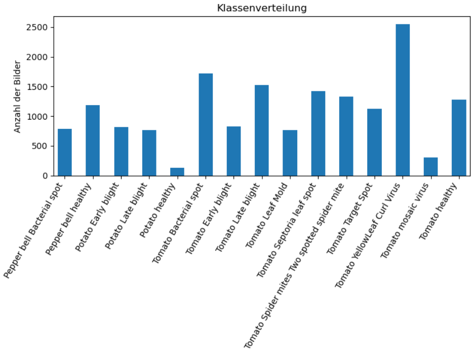
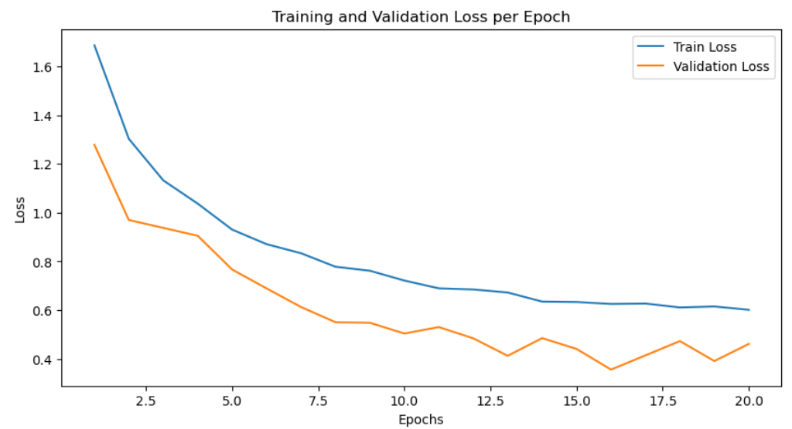
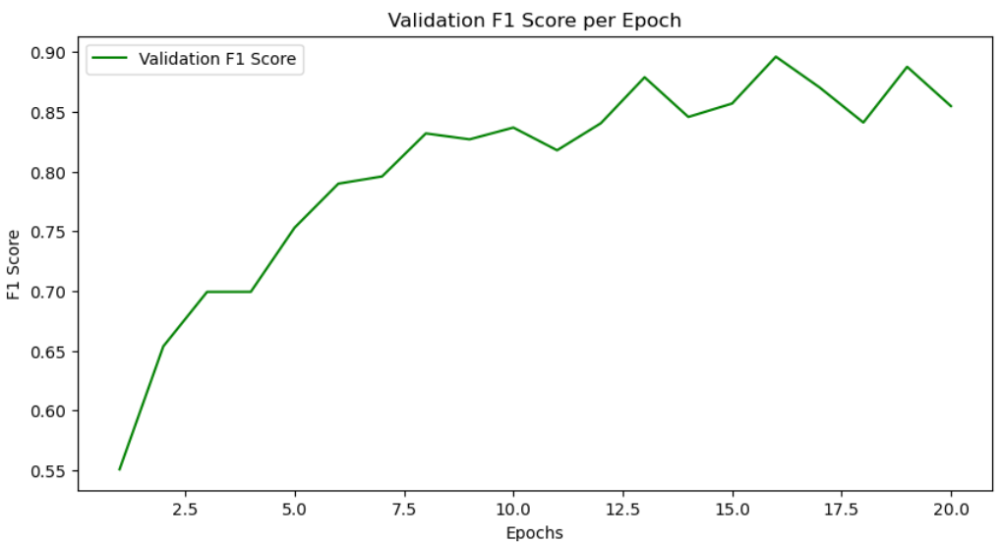

# PlantVillage-Projekt

Dieses Projekt verwendet Convolutional Neural Networks (CNNs) zur Klassifizierung von Pflanzenkrankheiten basierend auf dem **PlantVillage**-Datensatz.


## Inhaltsverzeichnis

- [Einleitung](#einleitung)
- [Verwandte Arbeiten](#verwandte-arbeiten)
- [Methode](#methode)
- [Ergebnisse](#ergebnisse)
- [Schlussfolgerung](#schlussfolgerung)
- [Anleitung](#anleitung)
- [Literaturverzeichnis](#literaturverzeichnis)

## Einleitung

Eine effektive Identifikation von Pflanzen und Pflanzenkrankheiten ist sowohl für Agrarindustrien als auch für Menschen mit Pflanzen im eigenen Haushalt von entscheidender Bedeutung, um Erträge zu maximieren, Pflanzen gesund zu halten und den Einsatz von Pestiziden und anderen Behandlungsmethoden gezielt zu steuern. Dadurch können Ressourcen effizienter genutzt und Ernteausfälle oder Pflanzenschäden vermieden werden.
Traditionelle Methoden wie manuelle Inspektion und Mikroskopie sind arbeitsintensiv und erfordern spezielles Fachwissen. Der Einsatz von Convolutional Neural Networks (CNNs) zur Identifikation von Pflanzen und Krankheiten bietet eine skalierbare Lösung, aber die Vielfalt der Pflanzenarten und Krankheitssymptome stellt erhebliche Herausforderungen dar, um eine hohe Genauigkeit über verschiedene Datensätze hinweg zu erreichen.

## Verwandte Arbeiten

Mohanty et al. (2016) evaluierten die Anwendbarkeit von tiefen Convolutional Neural Networks zur Erkennung von Pflanzenkrankheiten und verwendeten dabei die Architekturen AlexNet und GoogLeNet. Sie erreichten eine hohe Genauigkeit von 99,35 % auf dem PlantVillage-Datensatz und zeigten damit die Wirksamkeit dieser Modelle in diesem Bereich auf, wodurch ein starker Maßstab für zukünftige Forschungen zur automatisierten Klassifizierung von Pflanzenkrankheiten gesetzt wurde.

Ein Kaggle-Projekt mit dem Titel „Plant Disease Detection using Keras“ von Emmanuel (2018) implementierte ein CNN zur Klassifizierung von Pflanzenkrankheiten unter Verwendung des PlantVillage-Datensatzes und erreichte eine Validierungsgenauigkeit von 96,77 %. Das Modell wurde mit Keras trainiert und zur weiteren Verwendung gespeichert, wodurch der Einsatz von CNN-Architekturen zur Krankheitsklassifizierung bei Pflanzen demonstriert wird.

Bhattarai (2020) wandte eine ResNet-9-Architektur zur Klassifizierung von Pflanzenkrankheiten an und nutzte dabei ein großes, augmentiertes Datenset, um die Modellleistung zu verbessern. Er trainierte das Modell mit dem New Plant Diseases Dataset (Augmented), indem er es in Trainings- und Validierungsdatensätze aufteilte. Bhattarai verwendete Datenaugmentation, um die Generalisierungsfähigkeit des Modells zu verbessern, und erreichte eine hohe Genauigkeit von 98 %, was die Effektivität von ResNet-9 in der Klassifizierung von Pflanzenkrankheiten zeigt, wobei Einfachheit und Recheneffizienz in Balance gebracht wurden.

## Methode

Ein Convolutional Neural Network (CNN) wurde zur Klassifizierung von Pflanzenkrankheiten unter Verwendung des PlantVillage-Datensatzes implementiert. Die Bilder wurden durch Größenanpassung, Normalisierung und die Anwendung von Datenaugmentationstechniken wie zufälligem Zuschneiden und horizontalem Spiegeln vorverarbeitet, um die Generalisierungsfähigkeit des Modells zu verbessern. Der Datensatz wurde in Trainings-, Test- und Validierungsdatensätze aufgeteilt, um das Modell zu trainieren und dessen Leistung zu bewerten.
Eine anpassbare CNN-Architektur mit hyperparametrisierbaren Einstellungen wie Lernrate, Batch-Größe, Dropout-Rate, Optimierer und Anzahl der Faltungsschichten wurde entworfen. Diese Architektur wurde ausgewählt, um hierarchische Merkmale effizient zu erfassen, die für die Erkennung von Pflanzenkrankheiten unerlässlich sind.
Eine Hyperparameter-Suche wurde unter Verwendung eines Random Search-Ansatzes mit Kreuzvalidierung durchgeführt, um die optimale Konfiguration zu finden. Die Lernrate wurde variiert, um ein Gleichgewicht zwischen Konvergenzgeschwindigkeit und Stabilität zu erreichen, während verschiedene Batch-Größen getestet wurden, um das Modell effizient zu aktualisieren. Dropout-Raten wurden verwendet, um Overfitting durch die Kontrolle der Regularisierung zu vermeiden. Adam wurde aufgrund seiner adaptiven Lernraten ausgewählt, während SGD für seine Robustheit in Betracht gezogen wurde. Die Filtergrößen wurden angepasst, um verschiedene Ebenen der Merkmalserfassung in den Faltungsschichten zu erkunden.
Nach der Identifizierung der optimalen Parameter wurde das Modell mit dem gesamten Datensatz trainiert. Die Auswertung erfolgte anhand des F1-Scores, um dem Klassenungleichgewicht Rechnung zu tragen und eine ausgewogene Leistung über alle Kategorien hinweg sicherzustellen.
Das optimierte CNN-Modell für die Klassifizierung von Pflanzenkrankheiten hat die folgende Architektur:

- **Convolutional Layer 1:** 32 Filter, 3x3 Kernel-Größe, mit Batch-Normalisierung.
- **Convolutional Layer 2:** 64 Filter, 3x3 Kernel-Größe, mit Batch-Normalisierung.
- **Max Pooling Layer:** 2x2 Kernel-Größe, Schrittweite von 2.
- **Adaptive Average Pooling Layer:** Reduziert die Ausgabe auf 1x1.
- **Fully Connected Layer 1:** 512 Neuronen.
- **Dropout Layer:** Dropout-Rate von 0,5.
- **Fully Connected Layer 2:** Ausgabeschicht mit einer Anzahl von Neuronen, die der Anzahl der Klassen entspricht.
  
**Beste Parameter:** Optimierer: Adam, Lernrate: 0,01, Dropout: 0,5, Filter in Conv1: 64, Filter in Conv2: 128, Batch-Größe: 64.

GradCAM wurde ebenfalls implementiert, um Heatmaps zu erstellen, die die Fokusbereiche des Modells während der Vorhersage visualisieren und so die Interpretierbarkeit verbessern. Das leistungsstärkste Modell wurde gespeichert und zur Visualisierung von Vorhersagen mit neuen Daten verwendet, um seine Wirksamkeit für praktische Anwendungen zu validieren.

## Ergebnisse

Die Ergebnisse zeigen die Wirksamkeit der anpassbaren CNN-Architektur zur Klassifizierung von Pflanzenkrankheiten unter Verwendung des PlantVillage-Datensatzes. 
Wie in Abbildung 1 deutlich wird, zeigt das Klassenverhältnis innerhalb des Trainingsdatensatzes eine erhebliche Variabilität in der Anzahl der Proben in den verschiedenen Klassen. Einige Klassen, wie das 'Tomato Yellow Leaf Curl Virus', haben 3208 Proben, während andere, wie 'Potato healthy', nur 152 Proben aufweisen. Diese Unausgewogenheit kann zu verzerrtem Lernen führen, bei dem das Modell bei den häufiger vertretenen Klassen gut abschneidet, aber bei den unterrepräsentierten Klassen schlecht. Diese Variabilität erfordert einen ausgewogeneren Ansatz zur Modellevaluierung, der über einfache Genauigkeitsmetriken hinausgeht.



Die Trainings- und Validierungsverlustkurven, dargestellt in Abbildung 2, zeigen einen stetigen Rückgang über 20 Epochen, was darauf hindeutet, dass das Modell effektiv lernt und gut generalisiert, ohne dass es zu einer signifikanten Überanpassung kommt. Dieser gleichmäßige Rückgang des Verlustes deutet darauf hin, dass die Modellparameter während des Trainings angemessen optimiert werden



Der Verlauf des Validierungs-F1-Scores über die Epochen, dargestellt in Abbildung 3, zeigt eine deutliche Verbesserung und erreicht einen Höchstwert von 0,9062. Dieser hohe F1-Score bestätigt die Fähigkeit des Modells, verschiedene Pflanzenkrankheitskategorien genau zu unterscheiden und sowohl eine hohe Präzision als auch einen hohen Recall zu gewährleisten.



Die GradCAM-Visualisierungen für mehrere Bilder aus dem Validierungsdatensatz, dargestellt in Abbildung 4, bieten tiefere Einblicke in den Entscheidungsprozess des Modells. Diese Heatmaps heben die Bereiche der Bilder hervor, die am meisten zu den Vorhersagen des Modells beitragen, und machen es leichter, die Fokusbereiche des Modells zu verstehen. Diese zusätzliche Interpretierbarkeit trägt dazu bei, die Zuverlässigkeit des Modells in praktischen Anwendungen zu validieren.

## Schlussfolgerung

Der PlantVillage-Datensatz erwies sich als nützlich für die Klassifizierung von Pflanzenkrankheiten mit Convolutional Neural Networks (CNNs), insbesondere für Tomaten, Kartoffeln und Paprika. Die Größe des Datensatzes und die Anzahl der Bilder haben es ermöglicht, Modelle erfolgreich zu trainieren, die in der Lage sind, bestimmte Krankheiten gut zu erkennen.

Der Datensatz ist in seiner Vielfalt begrenzt, da er hauptsächlich auf drei Pflanzenarten fokussiert ist, was es den Modellen erschwert, auf andere Pflanzenarten zu generalisieren. Zudem besteht ein Ungleichgewicht in der Anzahl der Bilder für verschiedene Krankheiten, was die Modellleistung beeinträchtigen kann.

Zusammenfassend bietet der PlantVillage-Datensatz eine gute Grundlage für die Klassifizierung von Krankheiten in den verfügbaren Pflanzenarten, ist jedoch begrenzt in der Generalisierung auf andere Arten. Für gezielte landwirtschaftliche Anwendungen kann er dennoch wertvoll sein, wenn die Modelle entsprechend angepasst werden.

## Anleitung

### 1. Clone the Repository

Klonen Sie das Repository auf Ihre lokale Maschine oder speichern Sie es in Ihrem Google Drive:

```bash
git clone https://github.com/p-restani/PlantVillage.git
```


### 2. Download the Dataset

Lade das PlantVillage-Dataset von diesem [link](https://www.kaggle.com/datasets/emmarex/plantdisease) herunter. Nach dem Herunterladen stelle sicher, dass du den Pfad zum Dataset im Code anpasst, um den Speicherort des Datasets widerzuspiegeln.

````bash
data_dir = 'your-path-to-dataset/data/PlantVillage'
````

### 3. Using Google Colab

Wenn Sie Google Colab verwenden, folgen Sie diesen Schritten:

1. Laden Sie das Dataset auf Ihr Google Drive hoch.
2. Verbinden Sie Ihr Google Drive mit Colab, indem Sie den folgenden Befehl ausführen:

````bash
from google.colab import drive
drive.mount('/content/drive')

````


### 4. Run the Notebook

Sobald die Datensatzpfade aktualisiert sind, können Sie das gesamte Notebook ausführen, um das Modell zu trainieren:

1. Öffnen Sie die Notebook-Datei `PlantVillage.ipynb` in Google Colab oder Jupyter Notebook.
2. Führen Sie jede Zelle nacheinander aus, indem Sie auf die Schaltfläche "Ausführen" klicken oder `Shift + Enter` drücken.
3. Stellen Sie sicher, dass die Datensatzpfade gemäß den Anweisungen korrekt aktualisiert wurden.

### 5. Run the Notebook from Saved Model Parameters


Falls du das Modelltraining (Parameterabstimmung mit Cross-Validation) bereits abgeschlossen und die Modellparameter gespeichert hast, kannst du das gespeicherte Modell laden und von dort aus weitermachen. Folge diesen Schritten, um fortzufahren:

1. Öffne das Notebook PlantVillage_Notebook.ipynb in Google Colab oder Jupyter Notebook.
2. Führe die Import- und Datenvorverarbeitungsschritte erneut aus, um sicherzustellen, dass der Datensatz neu geladen und vorverarbeitet wird. Dies umfasst die Größenanpassung, Normalisierung und eventuelle Datenaugmentation.
3. Setze das Training ab dem Abschnitt „Training und Validierungsverlust / F1-Score über 20 Epochen“ fort.
   
### 6. Run the Notebook from GradCAM Visualization

**Hinweis**: Dieser Schritt setzt voraus, dass die Modellparameter gespeichert und das Modelltraining abgeschlossen wurden. Wenn das Training nicht abgeschlossen ist, müssen Sie den Trainingsprozess zuerst abschließen, bevor Sie GradCAM ausführen.

1. **Öffnen Sie das Notebook** PlantVillage.ipynb in Google Colab oder Jupyter Notebook.
2. **Führen Sie die Importe und die Datenvorverarbeitungsschritte erneut aus**, um sicherzustellen, dass der Datensatz neu geladen und vorverarbeitet wird.
3. Führen Sie die Zelle mit der Definition der CNN-Architektur erneut aus, bevor Sie das Modell laden:

````bash
class TunableCNN(nn.Module):
    def __init__(self, num_classes, conv1_out_channels, conv2_out_channels, dropout_rate):
        super(TunableCNN, self).__init__()
        self.conv1 = nn.Conv2d(3, conv1_out_channels, kernel_size=3, padding=1)
        self.bn1 = nn.BatchNorm2d(conv1_out_channels)
        self.conv2 = nn.Conv2d(conv1_out_channels, conv2_out_channels, kernel_size=3, padding=1)
        self.bn2 = nn.BatchNorm2d(conv2_out_channels)
        self.pool = nn.MaxPool2d(kernel_size=2, stride=2)
        self.adaptive_pool = nn.AdaptiveAvgPool2d((1, 1))
        self.fc1 = nn.Linear(conv2_out_channels * 1 * 1, 512)
        self.fc2 = nn.Linear(512, num_classes)
        self.dropout = nn.Dropout(dropout_rate)

    def forward(self, x):
        x = self.pool(F.relu(self.bn1(self.conv1(x))))
        x = self.pool(F.relu(self.bn2(self.conv2(x))))
        x = self.adaptive_pool(x)
        x = x.view(x.size(0), -1)
        x = F.relu(self.fc1(x))
        x = self.dropout(x)
        x = self.fc2(x)
        return x

````

4. Führen Sie die Zelle erneut aus, um die CSV-Datei mit den Ergebnissen des Hyperparameter-Tunings zu laden:

````bash
# Load the CSV file with a relative path
results_df = pd.read_csv('hyperparameter_results.csv')

# Display the dataframe to understand its structure
results_df.head()
````

5. Führen Sie die Zelle erneut aus, um die besten Parameter und deren entsprechende Metriken zu extrahieren:

````bash
# Extract the best parameters and their corresponding metrics
best_result = results_df.loc[results_df['f1_score'].idxmax()]
best_params = best_result.to_dict()
best_f1 = best_params['f1_score']

print(f'Best F1 Score: {best_f1}')
print(f'Best Params: {best_params}')
````

6. Fahren Sie fort, indem Sie die restlichen GradCAM-Zellen im Notebook ausführen.
   
## Literaturverzeichnis

Mohanty, S. P., Hughes, D. P., & Salathé, M. (2016). Using deep learning for image-based plant disease detection. Frontiers in Plant Science, 7, 1419. https://doi.org/10.3389/fpls.2016.01419

Emmanuel, T. O. (2018). . Plant Disease Detection using Keras. Retrieved from https://www.kaggle.com/code/emmarex/plant-disease-detection-using-keras

Bhattarai, S. (2020). "Plant Disease Classification using ResNet-9." Retrieved from https://www.kaggle.com/code/atharvaingle/plant-disease-classification-resnet-99-2/notebook


